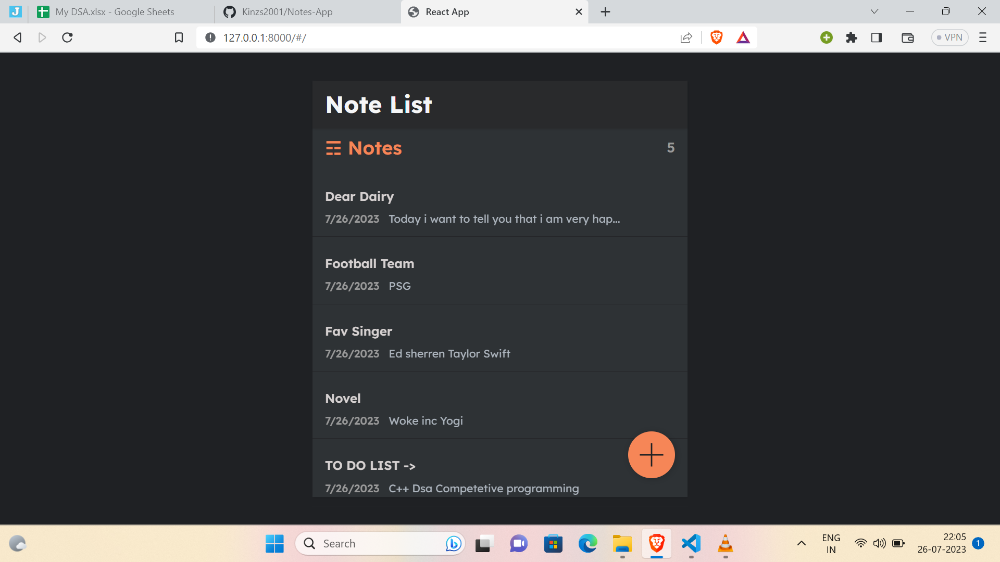
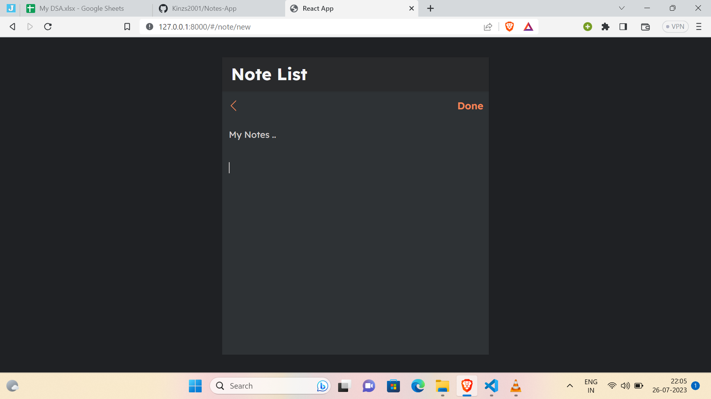

# Notes-App Using Django 

# Installation Setup
  - ### Create a virutal environment for the project and activate it
    -  #### Windows refer this -- > [windows setup](https://www.stanleyulili.com/django/how-to-install-django-on-windows/)
    - #### Ubuntu refer this ----> [ubutnut setup](https://www.javatpoint.com/django-virtual-environment-setup)
    - #### Mac refer this -------> [mac users setup](https://appdividend.com/2018/03/28/how-to-install-django-in-mac/)
  - You can create a folder for the project can direclty the repo using these `https://github.com/Kinzs2001/E-commerce-` .
  - install required dependies for the project using  ` pip install -r requirements.txt`.
  - make you are in the folder where the file python manage.py exists ,
  -  then run the command `python manage.py runserver ` to start the server ,
  -   click the link and you will be redirected to webpage of the project .

___

# Project images 
  - ## Home page 
    - ## These is how the home page looks 
       
    ------
  
    - ## How to edit and create new note.
        

